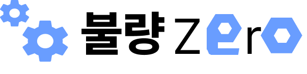
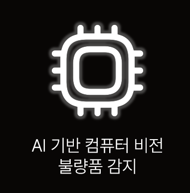
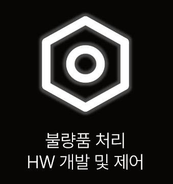
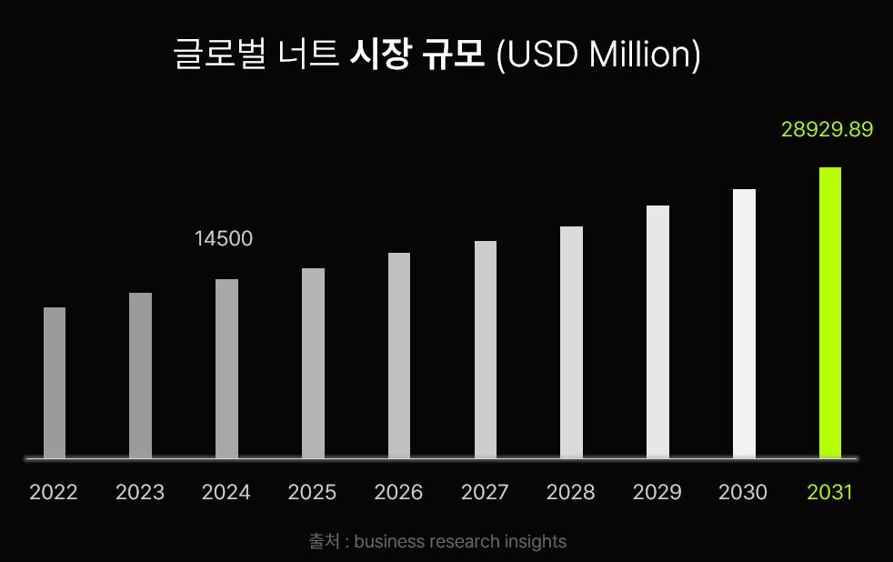
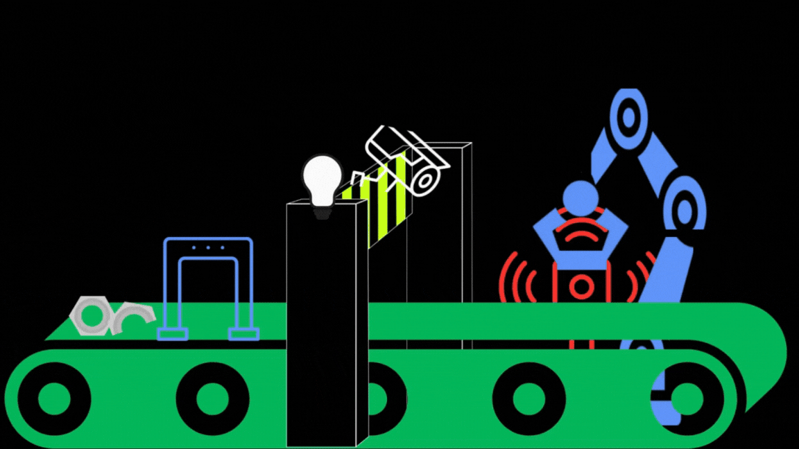
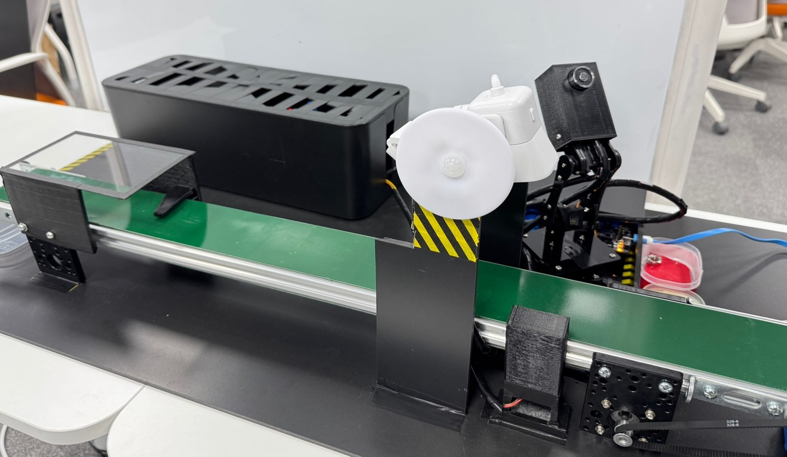
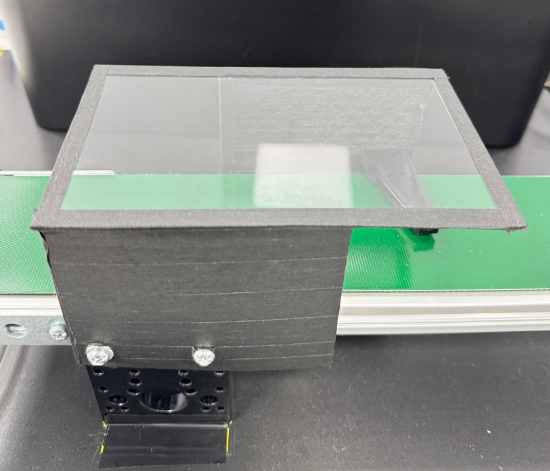
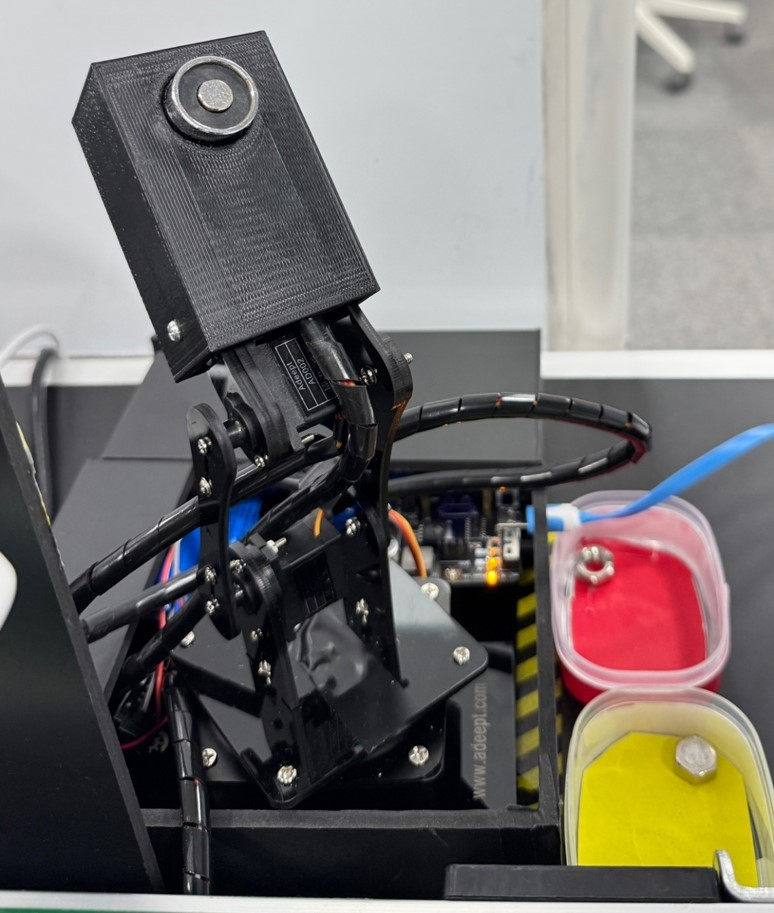
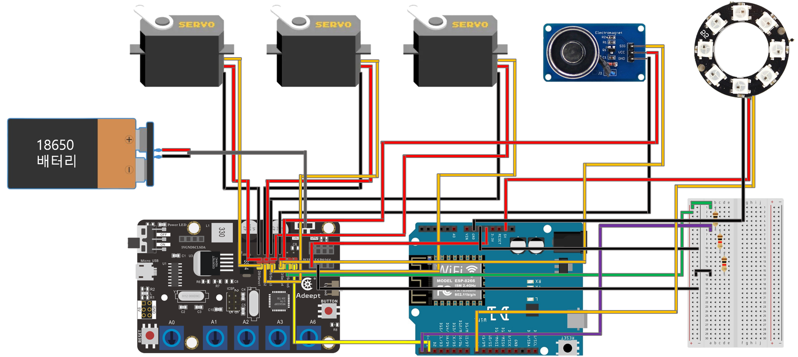

 

### 목차

### 🦺 [개요](#-개요) | 🎓 [사용 기술](#-사용-기술) | 💪 [팀원 소개](#-yesguys---팀원-소개) | 🏭 [서비스 소개](#-서비스-소개) | 🕋 [하드웨어 (HW)](#-하드웨어-hw) | 🎮 [소프트웨어 (SW)](#-소프트웨어-sw) | 📈 [시스템 아키텍쳐](#-시스템-아키텍쳐) |🕶 [기대효과](#-기대효과) |

## 🦺 개요

### 팀명: **Yes,Guys**

### 서비스명: **불량 Zero**  

### 개발기간: **2024년 10월 14일 ~ 11월 19일**

 

## 🎓 사용 기술

### INFRA

### BACKEND

### FRONTEND

### EMBEDDED

### Database

### AI

### Management

## 💪 Yes,Guys - 팀원 소개

<table style="table-layout: fixed;">
  <tr>
    <td style="text-align: center;">
        
    </td>
    <td style="text-align: center;">
        
    </td>
    <td style="text-align: center;">
        
    </td>
    <td style="text-align: center;">
        
    </td>
    <td style="text-align: center;">
        
    </td>
    <td style="text-align: center;">
        
    </td>
  </tr>
  <tr>
    <td style="text-align: center; word-wrap: break-word;">강현성 (팀장)</td>
    <td style="text-align: center; word-wrap: break-word;">김구태</td>
    <td style="text-align: center; word-wrap: break-word;">손우혁</td>
    <td style="text-align: center; word-wrap: break-word;">어지민</td>
    <td style="text-align: center; word-wrap: break-word;">임경태</td>
    <td style="text-align: center; word-wrap: break-word;">이창호 (IM)</td>
  </tr>
  <tr>
    <td style="text-align: center; word-wrap: break-word;">EM / FE </td>
    <td style="text-align: center; word-wrap: break-word;">INFRA / EM</td>
    <td style="text-align: center; word-wrap: break-word;">EM</td>
    <td style="text-align: center; word-wrap: break-word;">EM / FE</td>
    <td style="text-align: center; word-wrap: break-word;">AI / BE</td>
    <td style="text-align: center; word-wrap: break-word;">BE / INFRA</td>
  </tr>
  <tr>
    <td style="text-align: center; word-wrap: break-word;">...</td>
    <td style="text-align: center; word-wrap: break-word;">인프라 및 CI / CD 구축   HW 설계, 제작   컨베이어 벨트 제어   MQTT 연결 보조</td>
    <td style="text-align: center; word-wrap: break-word;">공장 HW 구축 및 통신 연결   3DOF 로봇 팔 역기구학 시뮬레이션 개발 및 제어  
네오 픽셀 LED, 전자석 등 주변 전자 부품 제어</td>
    <td style="text-align: center; word-wrap: break-word;">대시보드 레이아웃 설계 및 제작   컨베이어 벨트 제어  MQTT 연결  HW 제작 보조</td>
    <td style="text-align: center; word-wrap: break-word;">...</td>
    <td style="text-align: center; word-wrap: break-word;">조력자</td>
  </tr>
</table>

 

## 🏭 서비스 소개

### 😎 불량 너트 자동 선별 시스템 (정상, 재사용 가능, 불량)

 

### ⚙ 너트를 사용한 이유

- ### 표준화된 형태와 크기로 인한 데이터 수집의 용이
- ### 제품 품질을 결정하는데 중요한 역할
- ### 다양한 산업적 적용성
 

 

### 🐱‍🏍 전체 Flow

 

### 동작흐름

### 1. 컨베이어 벨트 이동

- #### 시스템이 작동하면 컨베이어 벨트가 시작되어 제품이 이동합니다.

### 2. 적외선 센서 감지

- #### 벨트 상에 설치된 적외선 센서가 너트를 감지하면 벨트가 즉시 정지합니다.

### 3. 카메라를 통한 품질 판별

- #### 정지 상태에서 카메라가 제품을 스캔하고 불량 여부를 판단합니다.
- #### AI 비전을 사용하여 제품의 품질을 분석하고 결과를 도출합니다.

### 4. 불량품 처리

- #### 불량으로 판별된 경우 로봇팔이 해당 제품을 즉시 분류하여 제거합니다.

### 5. 정상 제품 처리

- #### 불량이 아닌 경우 컨베이어 벨트가 다시 작동을 시작하여 다음 공정을 진행합니다.

 

## 🕋 하드웨어 (HW)

<table style="table-layout: fixed;">
  <tr>
    <td style="text-align: center;">
          
    </td>
  </tr>
  <tr>
    <td style="text-align: center; word-wrap: break-word;"> 불량 너트 자동 선별 시스템 (정상, 재사용 가능, 불량)   </td>
  </tr>
</table>

 

### 🕹 HW

<table style="table-layout: fixed;">
  <tr>
    <td style="text-align: center;">
          
    </td>
    <td style="text-align: center;">
         
    </td>
     <td style="text-align: center;">
         
    </td>
    <td style="text-align: center;">
         
    </td>
  </tr>
  <tr>
    <td style="text-align: center; word-wrap: break-word;"> Arduino </td>
    <td style="text-align: center; word-wrap: break-word;"> Raspberry-pi   </td>
    <td style="text-align: center; word-wrap: break-word;"> IR (적외선) 센서   </td>
    <td style="text-align: center; word-wrap: break-word;"> 카메라   </td>
  </tr>
  <tr>
    <td style="text-align: center; word-wrap: break-word;">로봇팔,
    컨베이어 벨트, 조명 & 온습도 센서 제어
     </td>
    <td style="text-align: center; word-wrap: break-word;"> AI 및 카메라 구동
     </td>
    <td style="text-align: center; word-wrap: break-word;">너트가 목표 지점 도착 시 감지 </td>
    <td style="text-align: center; word-wrap: break-word;"> 정상, 재사용, 불량 너트 판별 </td>
  </tr>
</table>

 

<table style="table-layout: fixed;">
  <tr>
    <td style="text-align: center;">
          
    </td>
    <td style="text-align: center;">
          
    </td>
  </tr>
  <tr>
    <td style="text-align: center; word-wrap: break-word;"> 너트 나열기 </td>
    <td style="text-align: center; word-wrap: break-word;"> 로봇팔 </td>
  </tr>
  <tr>
    <td style="text-align: center; word-wrap: break-word;"> 진동 기반 너트 정렬  
    CATIA V5를 활용해 설계한 구조물을 3D 프린터로 출력하여 제작
     </td>
    <td style="text-align: center; word-wrap: break-word;"> 끝단에 전자석을 부착하여 금속 너트를 처리  
    CATIA V5를 활용해 설계한 구조물을 3D 프린터로 출력하여 제작
    </td>
  </tr>
</table>

 

### 🧵 회로도

<table style="table-layout: fixed;">
  <tr>
    <td style="text-align: center;">
          
    </td>
    <td style="text-align: center;">
          
    </td>
  </tr>
  <tr>
    <td style="text-align: center; word-wrap: break-word;"> 로봇팔 부분 회로도 </td>
    <td style="text-align: center; word-wrap: break-word;"> 컨베이어 벨트 부분 회로도 </td>
  </tr>
</table>

## 🎮 소프트웨어 (SW)

## 📈 시스템 아키텍쳐

 

## 🕶 기대효과

### 1. 생산 효율성 향상

- #### 자동화 시스템을 통해 불량품을 빠르고 정확하게 선별하여 수작업에 비해 생산 속도를 크게 향상시킬 수 있습니다.

### 2.품질 관리 수준 강화

- #### 고해상도 카메라, 머신러닝 알고리즘, 센서를 활용해 결함을 감지하여 제품의 품질 일관성을 높일 수 있습니다.

### 3. 비용 절감

- #### 불량품 유통 방지로 인해 재작업 비용 및 고객 클레임 비용을 줄일 수 있으며, 인력 비용도 절감 가능합니다.

### 4. 고객 신뢰도 향상

- #### 높은 품질의 제품 제공으로 인해 브랜드 신뢰도가 증가하며, 장기적으로 고객 만족도를 높일 수 있습니다.

### 5. 데이터 기반 의사결정 가능

- #### 시스템이 수집한 결함 및 생산 데이터를 분석해 불량 원인을 파악하고, 이를 기반으로 공정 개선이 가능합니다.

### 6. 안정적인 작업 환경 조성

- #### 작업자의 부담을 줄여 인적 오류를 감소시키고, 작업 환경을 더 안전하고 효율적으로 만들 수 있습니다.
