SSAFY 전국 결선 141팀 중 3등 (지역 본선 1위) 수상 프로젝트

### AI 기반 스마트 팩토리 품질 공정 시스템

# 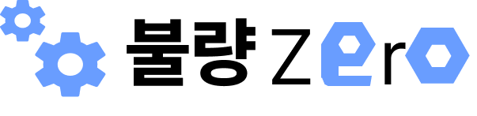 불량제로

## 📓 목차

1. [⭐ 사용 기술 ⭐](#사용-기술)
2. [⭐ 팀원 소개 ⭐](#팀원-소개)
3. [⭐ 서비스 소개 ⭐](#서비스-소개)
4. [⭐ HARDWARE 소개 ⭐](#hardware-소개)
5. [⭐ AI 소개 ⭐](#ai-소개)
6. [⭐ Network 소개 ⭐](#network-소개)
7. [⭐ 시스템 아키텍쳐 ⭐](#시스템-아키텍쳐)

## 사용 기술

<div>
  <h3>INFRA</h3>
  
  
  
  
</div>

<div>
  <h3>BACKEND</h3>
  
  
  
  
</div>

<div>
  <h3>FRONTEND</h3>
  
  
  
</div>

<div>
  <h3>EMBEDDED</h3>
  
  
  
  
  
</div>

<div>
  <h3>Database</h3>
  
</div>

<div>
  <h3>AI</h3>
  
  
  
</div>

<div>
  <h3>Management</h3>
  
  
  
</div>

## 팀원 소개

개발기간: **2024년 10월 14일 ~ 11월 19일**

<table style="table-layout: fixed;">
  <tr>
    <td style="text-align: center;">
        
    </td>
    <td style="text-align: center;">
        
    </td>
    <td style="text-align: center;">
        
    </td>
    <td style="text-align: center;">
        
    </td>
    <td style="text-align: center;">
        
    </td>
    <td style="text-align: center;">
        
    </td>
  </tr>
  <tr>
    <td style="text-align: center; word-wrap: break-word;">강현성 (팀장)</td>
    <td style="text-align: center; word-wrap: break-word;">김구태</td>
    <td style="text-align: center; word-wrap: break-word;">손우혁</td>
    <td style="text-align: center; word-wrap: break-word;">어지민</td>
    <td style="text-align: center; word-wrap: break-word;">임경태</td>
    <td style="text-align: center; word-wrap: break-word;">이창호 (취업으로 중도퇴소)</td>
  </tr>
  <tr>
    <td style="text-align: center; word-wrap: break-word;">EM / FE<br></td>
    <td style="text-align: center; word-wrap: break-word;">INFRA / EM</td>
    <td style="text-align: center; word-wrap: break-word;">EM</td>
    <td style="text-align: center; word-wrap: break-word;">EM / FE</td>
    <td style="text-align: center; word-wrap: break-word;">AI / BE</td>
    <td style="text-align: center; word-wrap: break-word;">BE / INFRA</td>
  </tr>
  <tr>
    <td style="word-wrap: break-word;">▪ PM <br>▪ 온디바이스 시스템 구축 <br>▪ HW Sourcing</td>
    <td style="word-wrap: break-word;">▪ 인프라 및 CI / CD 구축 <br>▪ HW 설계, 제작 <br>▪ 컨베이어 벨트 제어 <br>▪ MQTT 연결 보조</td>
    <td style="word-wrap: break-word;">▪ 공장 HW 구축 및 통신 연결 <br>▪ 3DOF 로봇 팔 역기구학 시뮬레이션 개발 및 제어 <br>▪ 네오 픽셀 LED, 전자석 등 주변 전자 부품 제어</td>
    <td style="word-wrap: break-word;">▪ 대시보드 레이아웃 설계 및 제작 <br>▪ 컨베이어 벨트 제어<br>▪ MQTT 연결<br>▪ HW 제작 보조</td>
    <td style="word-wrap: break-word;">▪ 데이터 수집 및 AI 전이 학습 모델 생성 <br>▪ MQTT 인프라 구축 및 연결<br>▪ ERD 설계 및 Backend 실시간 생산 기능 구현 <br>▪ Raspberry-Pi 통신 및 이미지 탐지 서비스 구현 <br>▪ PPT 제작</td>
    <td style="word-wrap: break-word;">▪ API 및 DB 설계, 개발</td>
  </tr>
</table>

<br/>

## 서비스 소개

### 💎 불량 너트 자동 선별 시스템 (정상, 재사용 가능, 불량)

<div>
  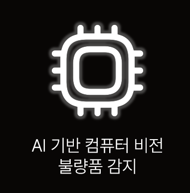
  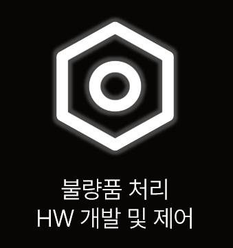
  
</div>

<br/>

### 💎 너트를 사용한 이유

- 표준화된 형태와 크기로 인한 데이터 수집의 용이
- 제품 품질을 결정하는데 중요한 역할
- 다양한 산업적 적용성

<br/>

### 💎 동작 Flow

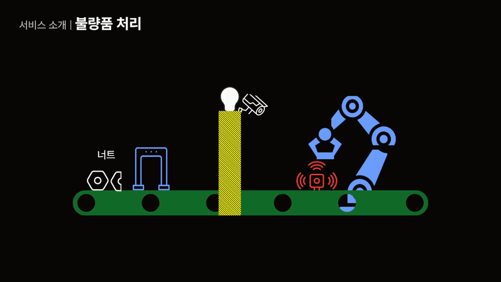
<br/>

1. 컨베이어 벨트 이동

   - 시스템이 작동하면 컨베이어 벨트가 시작되어 제품이 이동합니다.

2. 적외선 센서 감지

   - 벨트 상에 설치된 적외선 센서가 너트를 감지하면 벨트가 즉시 정지합니다.

3. 카메라를 통한 품질 판별

   - 정지 상태에서 카메라가 제품을 스캔하고 불량 여부를 판단합니다.
   - AI 비전을 사용하여 제품의 품질을 분석하고 결과를 도출합니다.

4. 불량품 처리

   - 불량으로 판별된 경우 로봇팔이 해당 제품을 즉시 분류하여 제거합니다.

5. 정상 제품 처리

   - 불량이 아닌 경우 컨베이어 벨트가 다시 작동을 시작하여 다음 공정을 진행합니다.

<br/>

### 💎 모니터링 대시보드

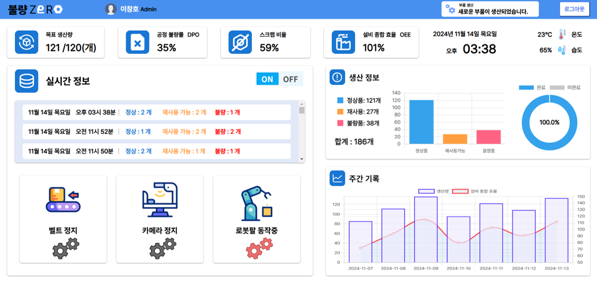

<br/>

1. 원격 공장 제어

   - 웹 대시보드를 통해 공장을 직접 제어 가능
   - 공장 가동 스위치를 클릭하여 원격으로 공장 가동 상태를 켜거나 끌 수 있음

2. 디지털 트윈 적용

   - 실시간 공장 가동 현황 표시
   - 현재 동작 중인 기계 상태를 시각적으로 확인 가능

3. 생산 현황 및 환경 데이터 제공

   - 대시보드 상단에서 당일 생산 현황 및 온습도 데이터 표시

4. 실시간 품질 로그 확인

   - 대시보드 중앙에서 실시간 너트 품질 로그 확인 가능

5. 통계 데이터 제공

   - 대시보드 우측에서 당일 및 주간 통계 제공
   - 공장 운영에 필요한 데이터 분석 자료 제공

<br/>

## HARDWARE 소개

<table style="table-layout: fixed;">
  <tr>
    <td style="text-align: center;">
         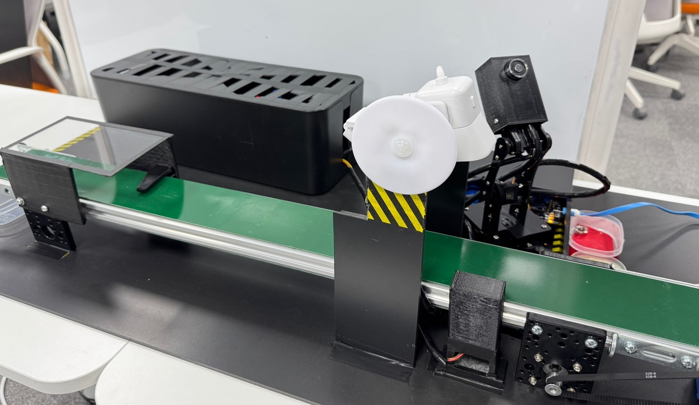 
    </td>
  </tr>
  <tr>
    <td style="text-align: center; word-wrap: break-word;"> 불량 너트 자동 선별 시스템 (정상, 재사용 가능, 불량)   </td>
  </tr>
</table>

<br/>

### 💎 HW

<table style="table-layout: fixed;">
  <tr>
    <td style="text-align: center;">
         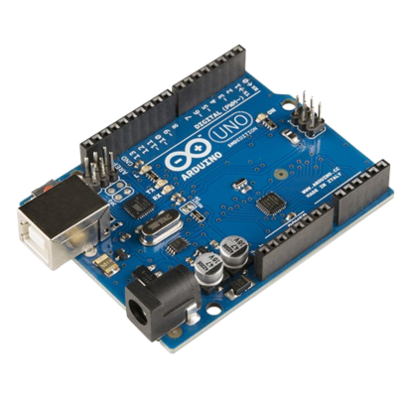 
    </td>
    <td style="text-align: center;">
         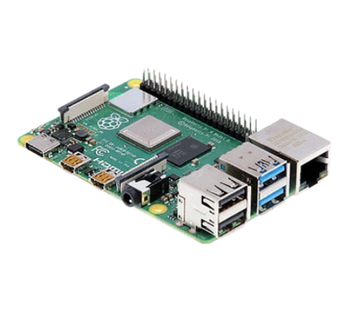
    </td>
     <td style="text-align: center;">
         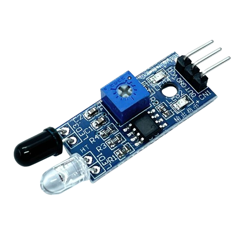
    </td>
    <td style="text-align: center;">
         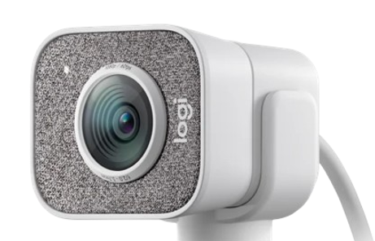
    </td>
  </tr>
  <tr>
    <td style="text-align: center; word-wrap: break-word;"> Arduino </td>
    <td style="text-align: center; word-wrap: break-word;"> Raspberry-pi   </td>
    <td style="text-align: center; word-wrap: break-word;"> IR (적외선) 센서   </td>
    <td style="text-align: center; word-wrap: break-word;"> 카메라   </td>
  </tr>
  <tr>
    <td style="text-align: center; word-wrap: break-word;">로봇팔,
    컨베이어 벨트, 조명 & 온습도 센서 제어
    <br></td>
    <td style="text-align: center; word-wrap: break-word;"> AI 및 카메라 구동
    <br></td>
    <td style="text-align: center; word-wrap: break-word;">너트가 목표 지점 도착 시 감지<br></td>
    <td style="text-align: center; word-wrap: break-word;"> 정상, 재사용, 불량 너트 판별<br></td>
  </tr>
</table>

<br/>

<table style="table-layout: fixed;">
  <tr>
    <td style="text-align: center;">
         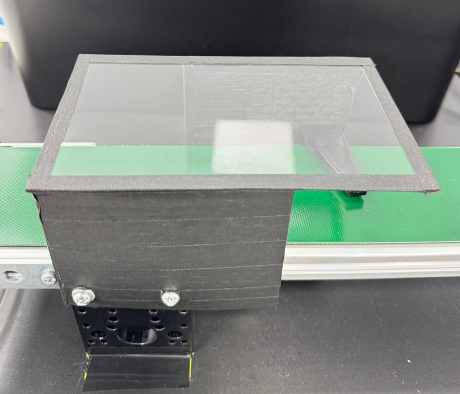 
    </td>
    <td style="text-align: center;">
         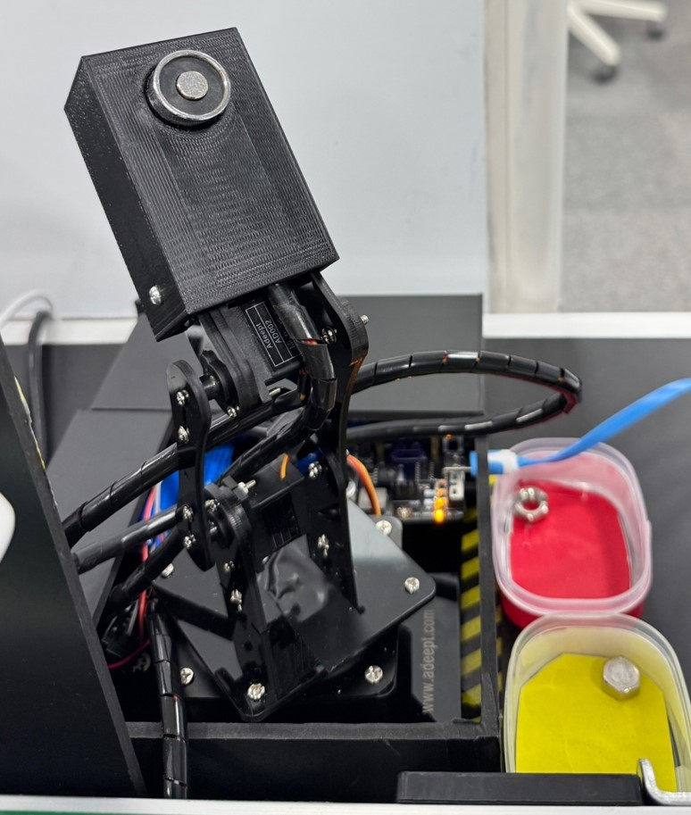 
    </td>
  </tr>
  <tr>
    <td style="text-align: center; word-wrap: break-word;"> 너트 나열기 </td>
    <td style="text-align: center; word-wrap: break-word;"> 로봇팔 </td>
  </tr>
  <tr>
    <td style="text-align: center; word-wrap: break-word;"> 진동 기반 너트 정렬 <br/>
    CATIA V5를 활용해 설계한 구조물을 3D 프린터로 출력하여 제작
    <br></td>
    <td style="text-align: center; word-wrap: break-word;"> 끝단에 전자석을 부착하여 금속 너트를 처리 <br>
    CATIA V5를 활용해 설계한 구조물을 3D 프린터로 출력하여 제작
    </td>
  </tr>
</table>

<br/>

### 💎 회로도

<table style="table-layout: fixed;">
  <tr>
    <td style="text-align: center;">
         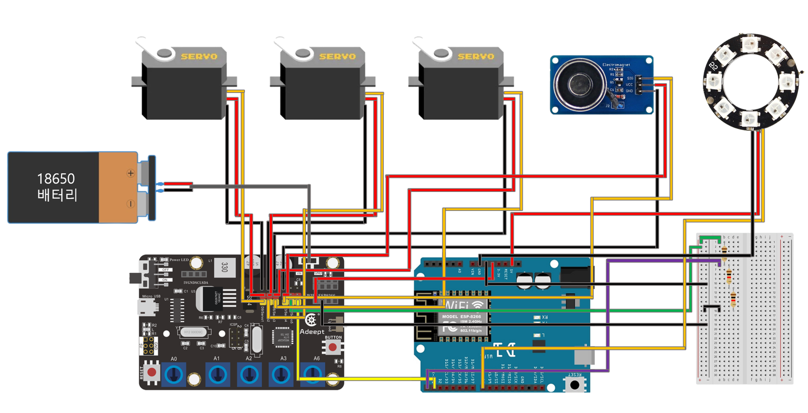 
    </td>
    <td style="text-align: center;">
         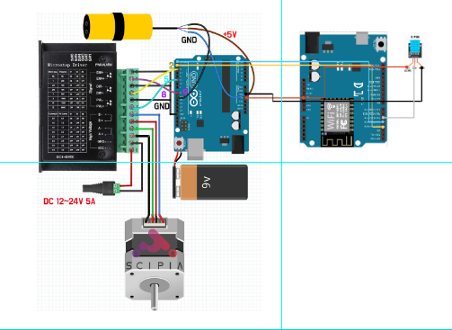 
    </td>
  </tr>
  <tr>
    <td style="text-align: center; word-wrap: break-word;"> 로봇팔 부분 회로도 </td>
    <td style="text-align: center; word-wrap: break-word;"> 컨베이어 벨트 부분 회로도 </td>
  </tr>
</table>

## AI 소개

### 💎 모델 선정

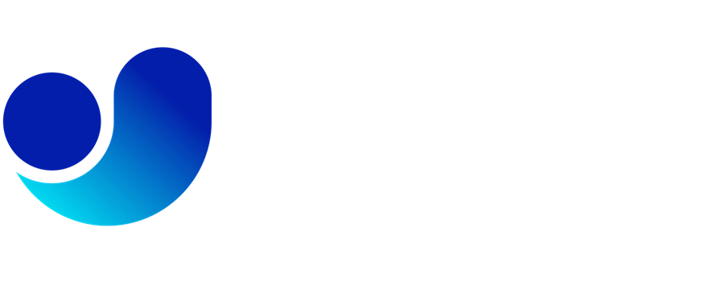

- 모델 : YOLOv11n
- 전이 학습 수행
- 선정 근거
  - Edge Device에 적합한 경량 모델 YOLOv11n 사용
  - YOLOv8 대비 22% 적은 파라미터로 더 높은 mAP 달성
  - Backbone Network 후 바로 Image Classification을 수행하는 One-stage Detector 방식
  - 실시간 객체 검출 및 즉각적인 반응이 필요한 스마트 팩토리에 제격

### 💎 데이터셋

- 개수 : 5400여개
- 이미지 증강
  - 논문 참조
    - Taylor, L., & Nitschke, G. (2017). Improving Deep Learning using Generic Data Augmentation. arXiv preprint arXiv:1708.06020.
  - 기본 증강
    - Flipping (좌우 반전)
    - Rotating (회전)
    - Cropping (자르기)
    - Fancy PCA (주성분 활용 색 변환)
    - Color Jittering (색상 변형)
  - 사용 환경에 따른 추가
    - Blurring (흐리기)
    - Brightening (밝기 조정)

### 💎 성능 평가

#### mAP50

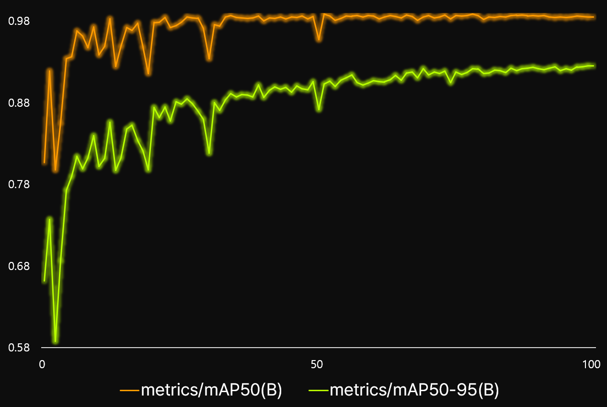<br>

- mAP 98.6% 달성

<table>
  <tr>
    <th style="text-align: center;">Before</th>
    <th style="text-align: center;">After</th>
  </tr>
  <tr>
    <td style="text-align: center;">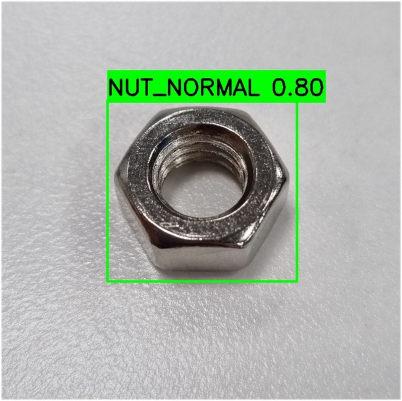</td>
    <td style="text-align: center;">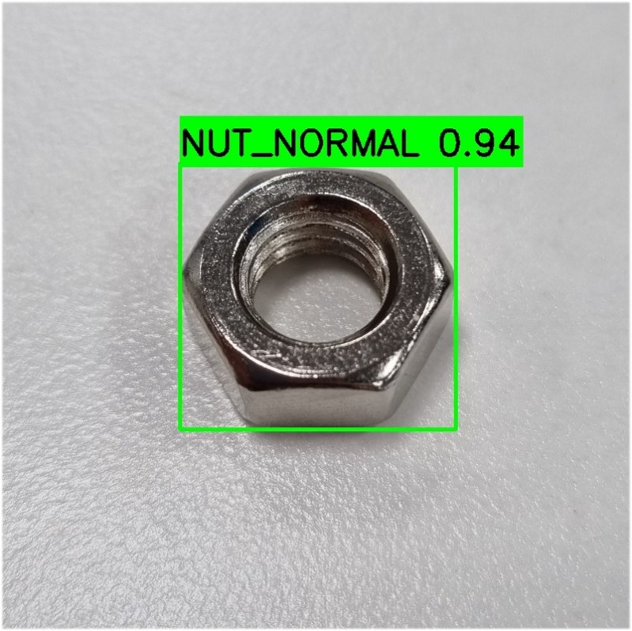</td>
  </tr>
  <tr>
    <td style="text-align: center;">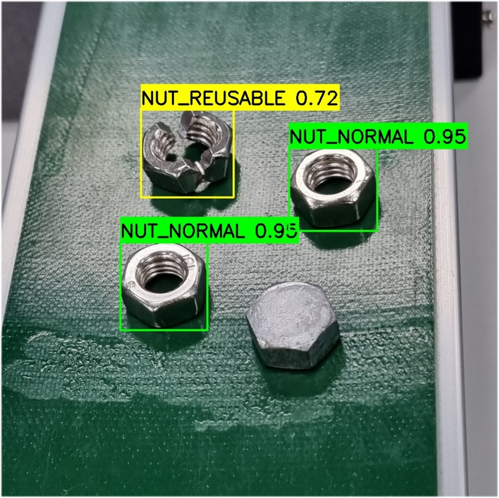</td>
    <td style="text-align: center;">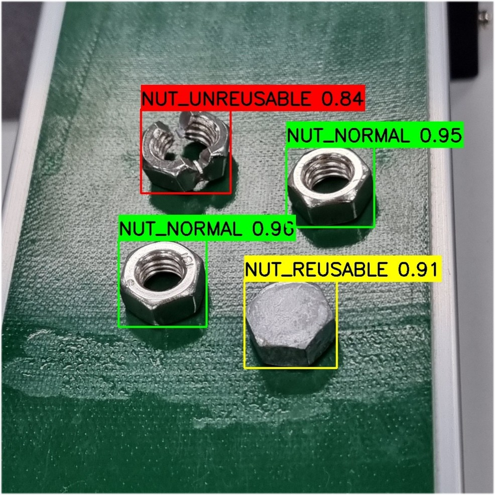</td>
  </tr>
</table>

#### Confusion Matrix

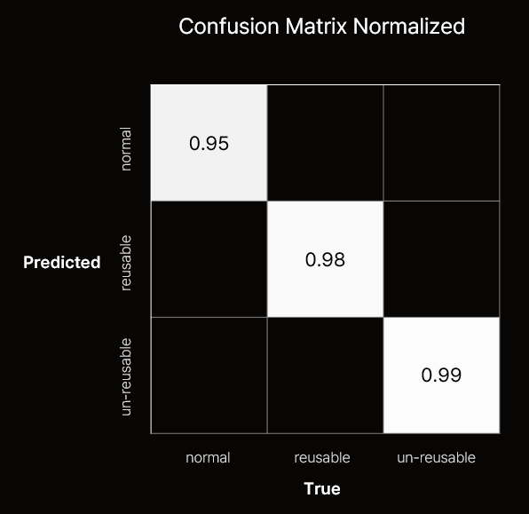<br>

<details>
<summary>HyperParameters</summary>

- **batch**: `16` - 배치 크기
- **imgsz**: `640` - 이미지 크기
- **lr0**: `0.01` - 초기 학습률
- **lrf**: `0.075` - 최종 학습률
- **momentum**: `0.937` - 모멘텀 요인
- **box**: `8.0` - 상자 손실 가중치
- **cls**: `1.0` - 분류 손실 가중치
- **dfl**: `2.0` - 초점 손실 가중치

</details>

### 💎 한계점 및 개선사항

- 이미지 증강 DCGAN 사용하여 진행하다 중단
- 다양한 데이터셋이 더 있었으면 좋았을 것 같음

## Network 소개

### 💎 MQTTv5

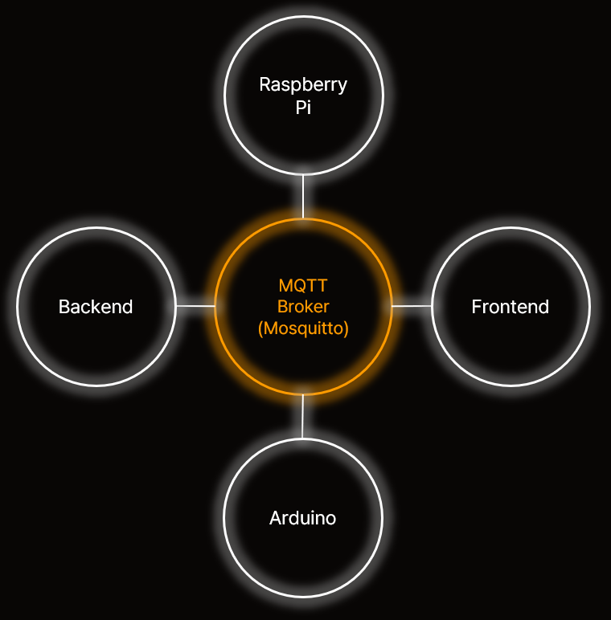<br>

- **Broker : Eclipse Mosquitto (서버 PC에서 Docker Image로 사용)**
- 도입 계기
  - 기존 IoT 기기 간 serial 통신의 안정성 문제 : 전압 차이에 의한 문제 및 확장성의 한계
  - 기존 HTTP SSE 통신 문제 : 단방향 통신 한정 지원 및 느린 데이터 처리 속도
  - **MQTT : 높은 확장성, 저대역폭 지원으로 안정성 확보, 경량 헤더를 통한 빠른 통신 속도 확보**

### 💎 토픽(topic) 구조

- realtime/oper : Frontend-IoT 작동 제어 관련 topic
- realtime/prod : IoT-FE, BE 생산 정보 통신 관련 topic
- realtime/circ : IoT-FE, BE 환경 정보 통신 관련 topic
- realtime/cycle : 생산 사이클 관련 topic

### 💎 메시지 포맷

- JSON 형식

```
  {
    sender: "sender_example",
    message: "message_example"
  }
```

### 💎 QoS (Quality of Service) 레벨

- 정확한 통신을 위해 QoS-2 사용

<table style="table-layout: fixed;">
  <tr style="background-color: #2E2E2E;">
    <td style="text-align: center; word-wrap: break-word;">QoS</td>
    <td style="text-align: center; word-wrap: break-word;">설명</td>
    <td style="text-align: center; word-wrap: break-word;">전송 보장</td>
    <td style="text-align: center; word-wrap: break-word;">중복 수신</td>
    <td style="text-align: center; word-wrap: break-word;">전송 지연</td>
    <td style="text-align: center; word-wrap: break-word;">사용 예시</td>
  </tr>
  <tr>
    <td style="text-align: center; word-wrap: break-word;">0</td>
    <td style="text-align: center; word-wrap: break-word;">At Most Once</td>
    <td style="text-align: center; word-wrap: break-word;">전송 보장 없음</td>
    <td style="text-align: center; word-wrap: break-word;">가능</td>
    <td style="text-align: center; word-wrap: break-word;">최소</td>
    <td style="text-align: center; word-wrap: break-word;">센서 데이터, 로그 수집</td>
  </tr>
  <tr>
    <td style="text-align: center; word-wrap: break-word;">1</td>
    <td style="text-align: center; word-wrap: break-word;">At Least Once</td>
    <td style="text-align: center; word-wrap: break-word;">최소 한번 전송</td>
    <td style="text-align: center; word-wrap: break-word;">가능</td>
    <td style="text-align: center; word-wrap: break-word;">보통</td>
    <td style="text-align: center; word-wrap: break-word;">알림 서비스, 채팅 메시지</td>
  </tr>
  <tr>
    <td style="text-align: center; word-wrap: break-word;">2</td>
    <td style="text-align: center; word-wrap: break-word;">Exactly Once</td>
    <td style="text-align: center; word-wrap: break-word;">정확히 한번 전송</td>
    <td style="text-align: center; word-wrap: break-word;">없음</td>
    <td style="text-align: center; word-wrap: break-word;">최대</td>
    <td style="text-align: center; word-wrap: break-word;">금융 거래, 주문 시스템</td>
  </tr>
</table>

### 💎 클라이언트 라이브러리 및 구현

- Spring : `Eclipse Paho Java`
- Vue : `Eclipse Paho HTML5 JavaScript over WebSocket`
- Arduino : `PubSub Client`
- Raspberry Pi : `Eclipse Paho Python`

---

## 시스템 아키텍쳐

 
