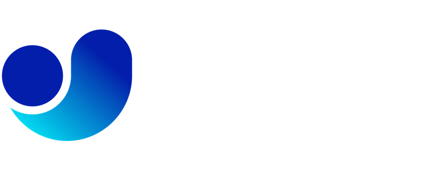
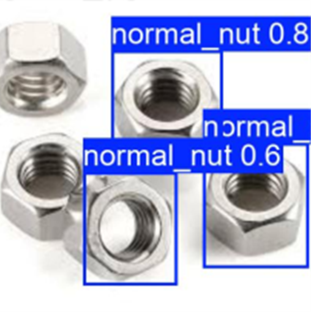
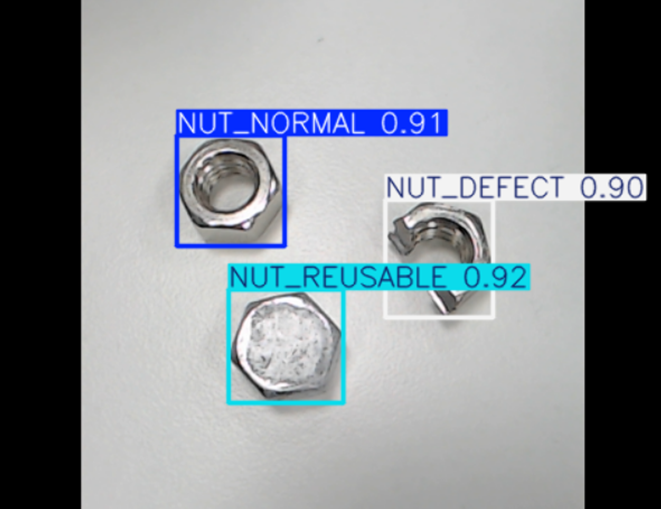
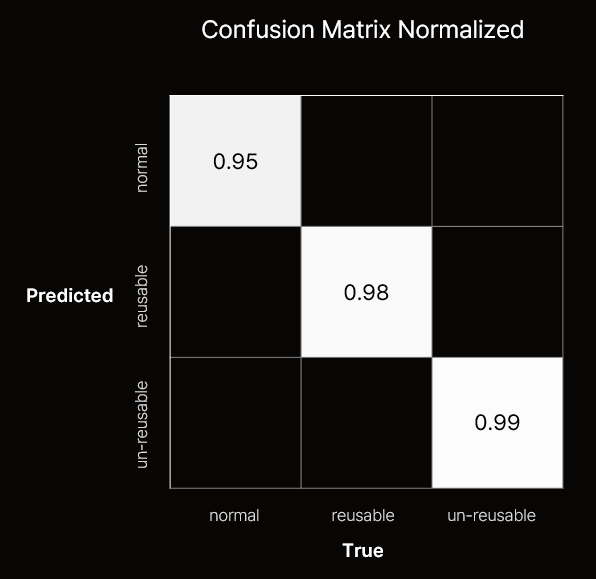

### AI 기반 품질 선별 스마트 팩토리 시스템

#  ⚙ 불량 Zero

 

## 🦺 개요

팀명: **Yes,Guys**  
 서비스명: **불량 Zero**  
 개발기간: **2024년 10월 14일 ~ 11월 19일 (6주)**

 

## 💪 사용 기술

### INFRA

### BACKEND

### FRONTEND

### EMBEDDED

### AI

### Management

## 💪 Yes,Guys - 팀원 소개

<table style="table-layout: fixed;">
  <tr>
    <td style="text-align: center;">
        
    </td>
    <td style="text-align: center;">
        
    </td>
    <td style="text-align: center;">
        
    </td>
    <td style="text-align: center;">
        
    </td>
    <td style="text-align: center;">
        
    </td>
    <td style="text-align: center;">
        
    </td>
  </tr>
  <tr>
    <td style="text-align: center; word-wrap: break-word;">강현성</td>
    <td style="text-align: center; word-wrap: break-word;">임경태</td>
    <td style="text-align: center; word-wrap: break-word;">김구태</td>
    <td style="text-align: center; word-wrap: break-word;">손우혁</td>
    <td style="text-align: center; word-wrap: break-word;">어지민</td>
    <td style="text-align: center; word-wrap: break-word;">이창호(보류)</td>
  </tr>
  <tr>
    <td style="text-align: center; word-wrap: break-word;">팀장 </td>
    <td style="text-align: center; word-wrap: break-word;">...</td>
    <td style="text-align: center; word-wrap: break-word;">...</td>
    <td style="text-align: center; word-wrap: break-word;">...</td>
    <td style="text-align: center; word-wrap: break-word;">...</td>
    <td style="text-align: center; word-wrap: break-word;">...</td>
  </tr>
  <tr>
    <td style="text-align: center; word-wrap: break-word;">...</td>
    <td style="text-align: center; word-wrap: break-word;">...</td>
    <td style="text-align: center; word-wrap: break-word;">...</td>
    <td style="text-align: center; word-wrap: break-word;">...</td>
    <td style="text-align: center; word-wrap: break-word;">...</td>
    <td style="text-align: center; word-wrap: break-word;">...</td>
  </tr>
</table>

 

## 🏭 서비스 소개

### 😎 불량 너트 자동 선별 시스템 (정상, 재사용 가능, 불량)

 

### ⚙ 너트를 사용한 이유

- ### 표준화된 형태와 크기로 인한 데이터 수집의 용이
- ### 제품 품질을 결정하는데 중요한 역할
- ### 다양한 산업적 적용성
 

 

### 🐱‍🏍 전체 Flow

 

### 동작흐름

### 1. 컨베이어 벨트 이동

- #### 시스템이 작동하면 컨베이어 벨트가 시작되어 제품이 이동합니다.

### 2. 적외선 센서 감지

- #### 벨트 상에 설치된 적외선 센서가 너트를 감지하면 벨트가 즉시 정지합니다.

### 3. 카메라를 통한 품질 판별

- #### 정지 상태에서 카메라가 제품을 스캔하고 불량 여부를 판단합니다.
- #### AI 비전을 사용하여 제품의 품질을 분석하고 결과를 도출합니다.

### 4. 불량품 처리

- #### 불량으로 판별된 경우 로봇팔이 해당 제품을 즉시 분류하여 제거합니다.

### 5. 정상 제품 처리

- #### 불량이 아닌 경우 컨베이어 벨트가 다시 작동을 시작하여 다음 공정을 진행합니다.

 

## 🕋 하드웨어 (HW)

<table style="table-layout: fixed;">
  <tr>
    <td style="text-align: center;">
          
    </td>
  </tr>
  <tr>
    <td style="text-align: center; word-wrap: break-word;"> 불량 너트 자동 선별 시스템 (정상, 재사용 가능, 불량)   </td>
  </tr>
</table>

 

### 🕹 HW

<table style="table-layout: fixed;">
  <tr>
    <td style="text-align: center;">
          
    </td>
    <td style="text-align: center;">
         
    </td>
     <td style="text-align: center;">
         
    </td>
    <td style="text-align: center;">
         
    </td>
  </tr>
  <tr>
    <td style="text-align: center; word-wrap: break-word;"> Arduino </td>
    <td style="text-align: center; word-wrap: break-word;"> Raspberry-pi   </td>
    <td style="text-align: center; word-wrap: break-word;"> IR (적외선) 센서   </td>
    <td style="text-align: center; word-wrap: break-word;"> 카메라   </td>
  </tr>
  <tr>
    <td style="text-align: center; word-wrap: break-word;">로봇팔,
    컨베이어 벨트, 조명 & 온습도 센서 제어
     </td>
    <td style="text-align: center; word-wrap: break-word;"> AI 및 카메라 구동
     </td>
    <td style="text-align: center; word-wrap: break-word;">너트가 목표 지점 도착 시 감지 </td>
    <td style="text-align: center; word-wrap: break-word;"> 정상, 재사용, 불량 너트 판별 </td>
  </tr>
</table>

 

<table style="table-layout: fixed;">
  <tr>
    <td style="text-align: center;">
          
    </td>
    <td style="text-align: center;">
          
    </td>
  </tr>
  <tr>
    <td style="text-align: center; word-wrap: break-word;"> 너트 나열기 </td>
    <td style="text-align: center; word-wrap: break-word;"> 로봇팔 </td>
  </tr>
  <tr>
    <td style="text-align: center; word-wrap: break-word;"> 진동 기반 너트 정렬  
    CATIA V5를 활용해 설계한 구조물을 3D 프린터로 출력하여 제작
     </td>
    <td style="text-align: center; word-wrap: break-word;"> 끝단에 전자석을 부착하여 금속 너트를 처리  
    CATIA V5를 활용해 설계한 구조물을 3D 프린터로 출력하여 제작
    </td>
  </tr>
</table>

### 🎮 AI

#### 📌 모델 선정

- 모델 : YOLOv11n
- 전이 학습 수행
- 선정 근거
  - Edge Device에 적합한 경량 모델 YOLOv11n 사용
  - YOLOv8 대비 22% 적은 파라미터로 더 높은 mAP 달성
  - Backbone Network 후 바로 Image Classification을 수행하는 One-stage Detector 방식
  - 실시간 객체 검출 및 즉각적인 반응이 필요한 스마트 팩토리에 제격

#### 📌 데이터셋

- 개수 : 5400여개
- 이미지 증강
  - 논문 참조
    - Taylor, L., & Nitschke, G. (2017). Improving Deep Learning using Generic Data Augmentation. arXiv preprint arXiv:1708.06020.
  - 기본 증강
    - Flipping (좌우 반전)
    - Rotating (회전)
    - Cropping (자르기)
    - Fancy PCA (주성분 활용 색 변환)
    - Color Jittering (색상 변형)
  - 사용 환경에 따른 추가
    - Blurring (흐리기)
    - Brightening (밝기 조정)

#### 📌 성능 평가

##### mAP50

 
- mAP 98.6% 달성

##### before

 

##### after

 

##### Confusion Matrix

 

HyperParameters

- **batch**: `16` - 배치 크기
- **imgsz**: `640` - 이미지 크기
- **lr0**: `0.01` - 초기 학습률
- **lrf**: `0.075` - 최종 학습률
- **momentum**: `0.937` - 모멘텀 요인
- **box**: `8.0` - 상자 손실 가중치
- **cls**: `1.0` - 분류 손실 가중치
- **dfl**: `2.0` - 초점 손실 가중치

#### 📌 한계점 및 개선사항

- 이미지 증강 DCGAN 사용하여 진행하다 중단
- 다양한 데이터셋이 더 있었으면 좋았을 것 같음

### 🎮 Network

#### 📌 MQTT

- Broker : Eclipse Mosquitto

#### 📌 토픽(topic) 구조

#### 📌 메시지 포맷

#### 📌 QoS (Quality of Service) 레벨

#### 📌 클라이언트 라이브러리 및 구현

